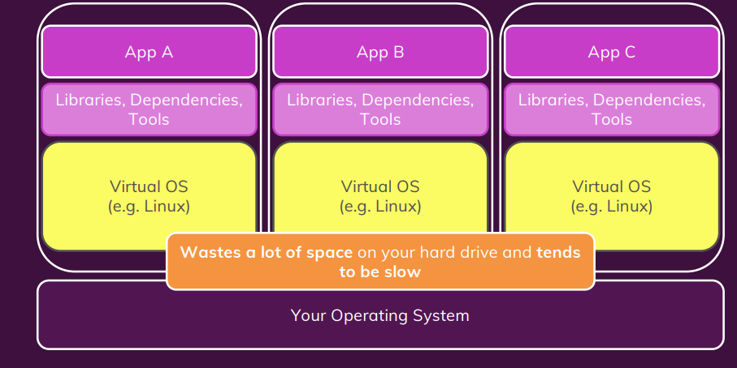
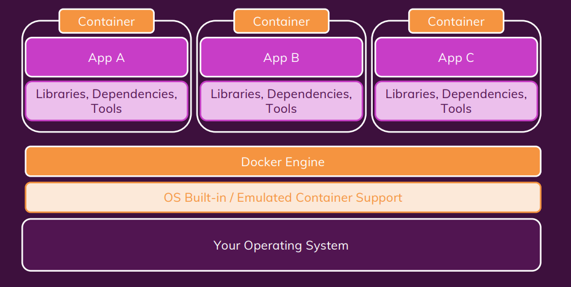

### Docker Notes

#### Docker

Docker is a tool for managing containers

### Container

A package of code and its dependencies to run / execeute code

Advantages of containerization

1. allows to have same environtment in dev, QA and production
2. share same env accross all team members
3. prevent dependency clashes between applications

### VM's vs Containers

Virtual machines allows us to install multiple virtual OS on top a machine.
Virtual machines also solves the above problems.

Disadvantages: VM doesnt share the OS. same virtual needs to be replicated around VM's
so wastage of space and memory.

### Docker File Contents

1. FROM - BASE image
2. LABEL - meta data
   LABEL version="1.2.1"
3. ARG Defines a variable that users can pass at build
time. Multiple ARG instructions can be defined. ARG JAR_FILE
4. RUN Executes the commands passed as arguments
in a new layer on top of the existing ones. Multi-
ple RUN instructions can be defined. RUN apt-get update && apt-
get install -y default-jre
5. COPY Copies files or directories from the host filesys-
tem to the one inside the container. COPY app-0.0.1-
SNAPSHOT.jar app.jar
6. USER Defines the user that will run all the subsequent
instructions and the image itself (as a container). USER sheldon
7. ENTRYPOINT Defines the program to execute when the image
is run as a container. Only the last ENTRYPOINT
instruction in a Dockerfile is considered. ENTRYPOINT ["/bin/bash"]
CMD Specifies defaults for an executing container. If
the ENTRYPOINT instruction is defined, they
are passed as arguments. If not, it should also
contain an executable. Only the last CMD
instruction in a Dockerfile is considered. CMD ["sleep", "10"]

### cmd vs run

run exectued when building image and cmd executed when starting container

### images vs container

images are templates for building containers